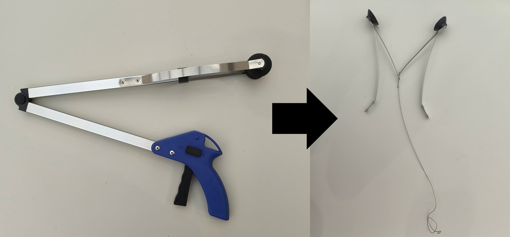
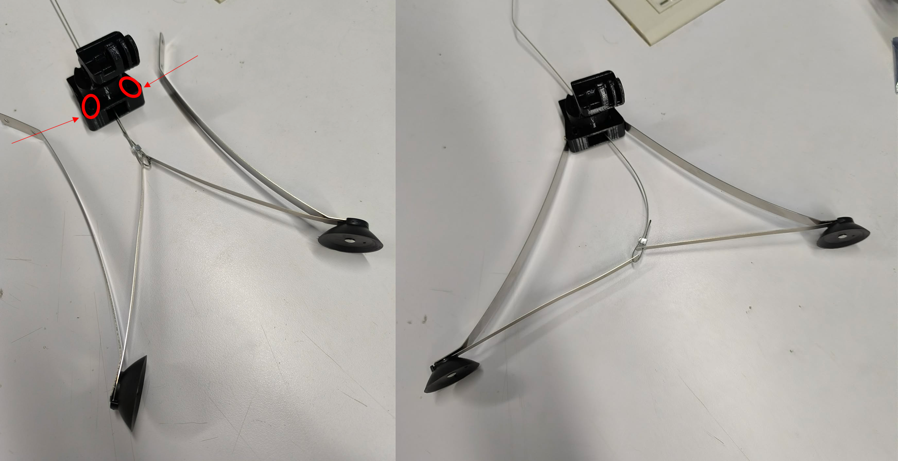
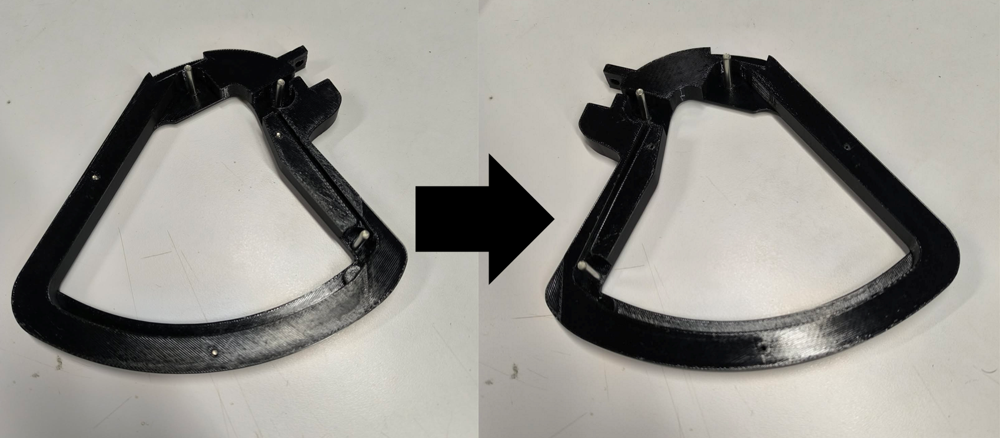
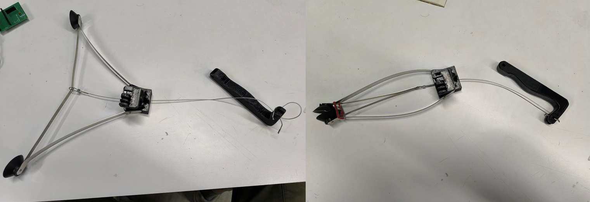
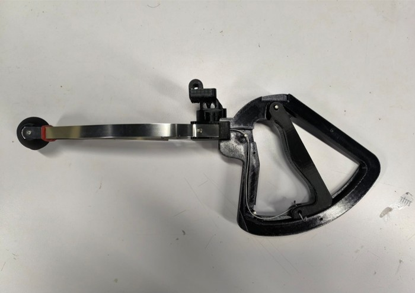
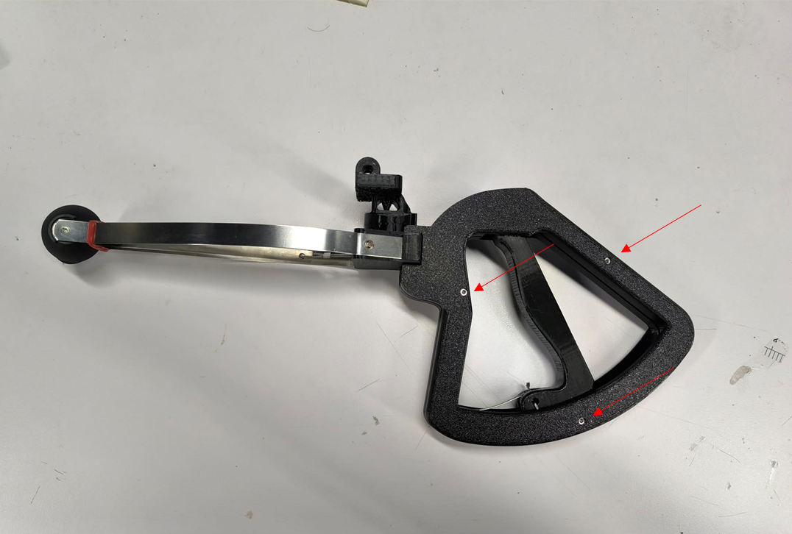
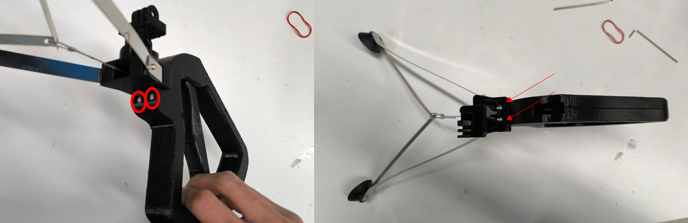
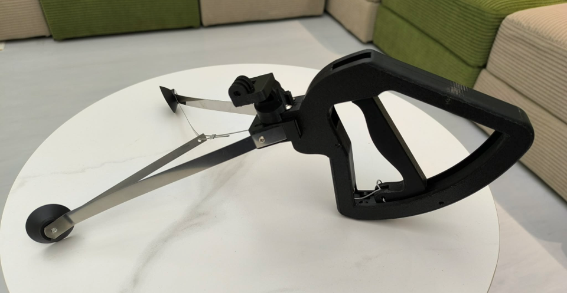

1. Use a 3D printer to print all parts

* [left_handle](../stickBody/left_handle.stl)
* [right_handle](../stickBody/right_handle.stl)
* [dobbe_trigger](../stickBody/dobbe_trigger.STL)
* [stick_v3_body_and_phone_mount](stick_v3_body_and_phone_mount.stl)

2. Disassemble the trash gripper and keep only the gripping jaws

Before proceeding to the next step, it is recommended to put Heat Shrink Tubing over the jaws to prevent cutting your hands.

3. Attach the jaws to the stick_v3_body_and_phone_mount

Place the nut into the red circled area, then tighten the screw following the direction of the arrow.

4. Insert the Dowel Pin into the hole of the left_handle (it will require some force), then remove the Dowel Pin and insert it into the hole of the right_handle (this helps align both holes to make fixing the Dowel Pin easier in the next steps).

5. Secure the gripper cable to the dobbe_trigger, cut off any excess cable, and temporarily secure the gripper with a rubber band.

6. Attach the dobbe_trigger to the right_handle, and secure the cable into the groove on the right_handle, routing it around the Dowel Pin.

7. Place the left_handle cover on and fasten it with Thread-Forming Screws.

8. Fasten the stick_v3_body_and_phone_mount to the right_handle and left_handle with screws, then remove the rubber band.

9. Finished

